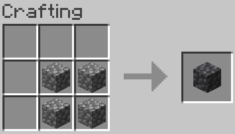
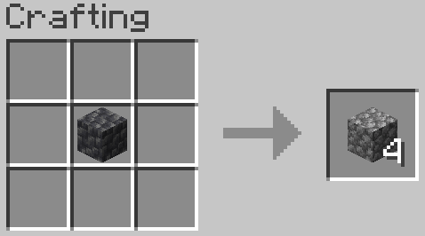
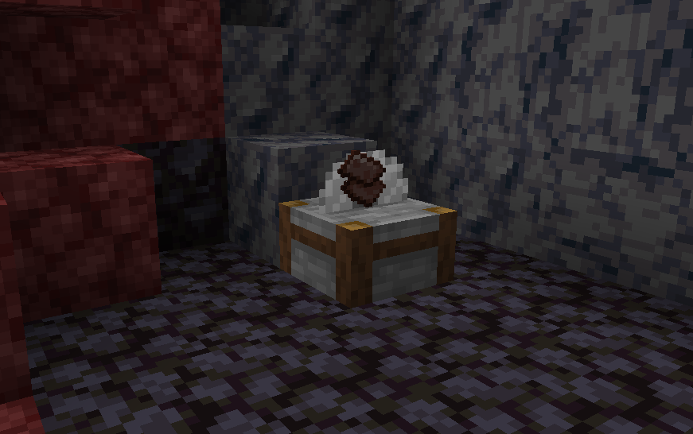

# Stone magic
A datapack for minecraft focused around converting one useless stone into another one.

## New recipes
This datapack adds two new recipes.

### Stones to deepslate
Recipe above will make it easier to get deepslate for builds and for a [new feature bellow](#new-stonecutter-feature).

### Deepslate to stone
This one is a reverse of a one above.

## New stonecutter feature
You always end up mining lots of useless stone. 
This new feature allows you to use them for gambling.

Some of the stones *may* convert into useful resources when dropped on top of a stonecutter.

Thrown cobbled deepslate have better chances to yield materials when cobblestone. Smelting cobbles into stones before cutting increase yield chances.

Netherite scrap *may* be got from nether stones this way.